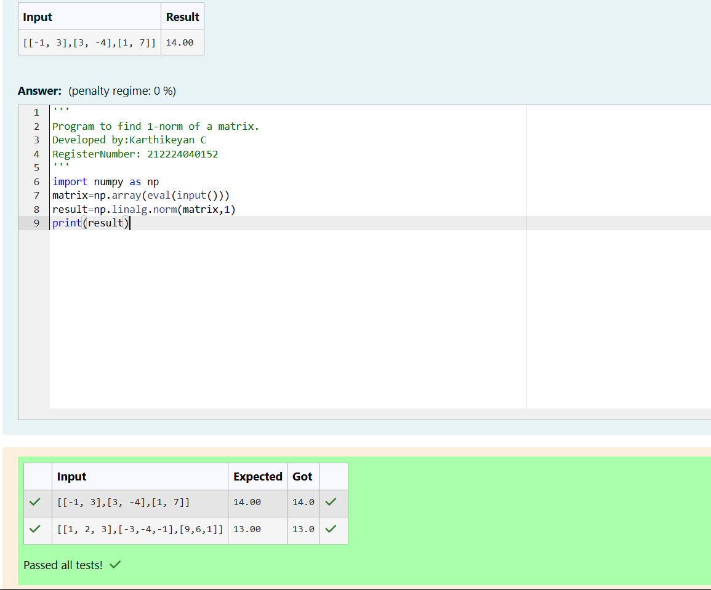
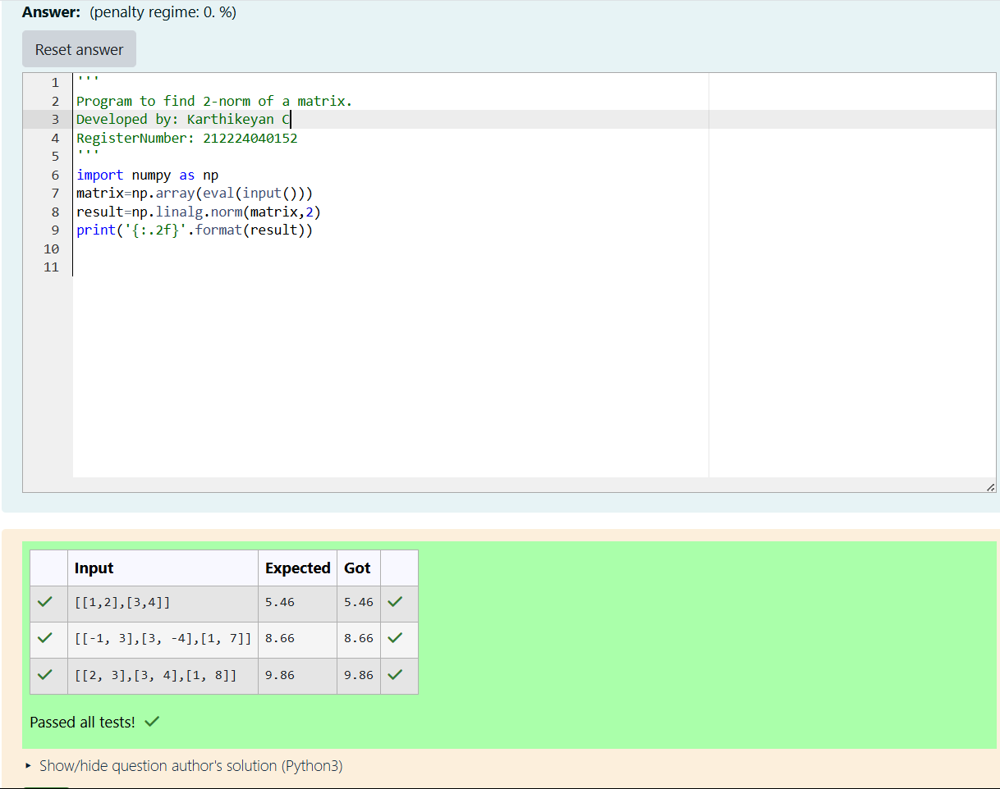
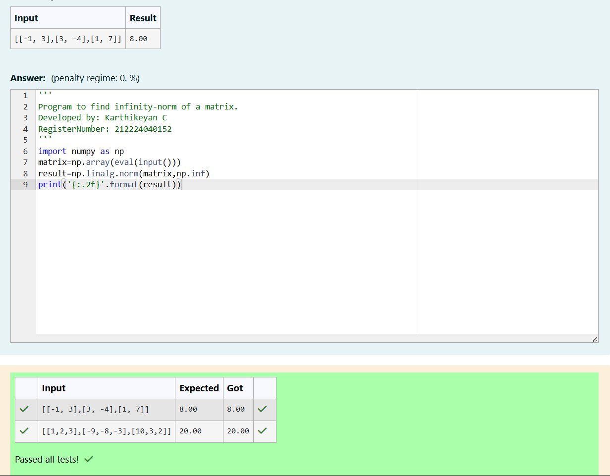

# Norm of a matrix
## Aim
To write a program to find the 1-norm, 2-norm and infinity norm of the matrix and display the result in two decimal places.
## Equipment’s required:
1.	Hardware – PCs
2.	Anaconda – Python 3.7 Installation / Moodle-Code Runner
## Algorithm:

### **Algorithm: 1-Norm of a Matrix**

1. **Input** a matrix from the user and convert it to a NumPy array.
2. **Use** `np.linalg.norm()` with the `ord=1` parameter to compute the 1-Norm.
3. **The 1-Norm** is the maximum absolute column sum of the matrix.
4. **Print** the resulting norm value.

### **Algorithm: 2-Norm of a Matrix**

1. **Input** a matrix and convert it into a NumPy array.
2. **Use** `np.linalg.norm(matrix, 2)` to compute the 2-Norm.
3. **The 2-Norm** is the largest singular value of the matrix (also called spectral norm).
4. **Print** the result, formatted to two decimal places.

### **Algorithm: Infinity Norm of a Matrix**

1. **Input** a matrix from the user and convert it to a NumPy array.
2. **Use** `np.linalg.norm(matrix, np.inf)` to calculate the ∞-Norm.
3. **The ∞-Norm** is the maximum absolute row sum of the matrix.
4. **Print** the resulting value, formatted to two decimal places.


## Program:
```Python
# Register No:212224040152
# Developed By:Karthikeyan C
# 1-Norm of a Matrix
import numpy as np
matrix=np.array(eval(input()))
result=np.linalg.norm(matrix,1)
print(result)


# 2-Norm of a Matrix
import numpy as np
matrix=np.array(eval(input()))
result=np.linalg.norm(matrix,2)
print('{:.2f}'.format(result))


# Infinity Norm of a Matrix
import numpy as np
matrix=np.array(eval(input()))
result=np.linalg.norm(matrix,np.inf)
print('{:.2f}'.format(result))


```
## Output:
### 1-Norm of a Matrix

<br>


### 2-Norm of a Matrix

<br>

### Infinity Norm of a Matrix

<br>

## Result
Thus the program for 1-norm, 2-norm and Infinity norm of a matrix are written and verified.
